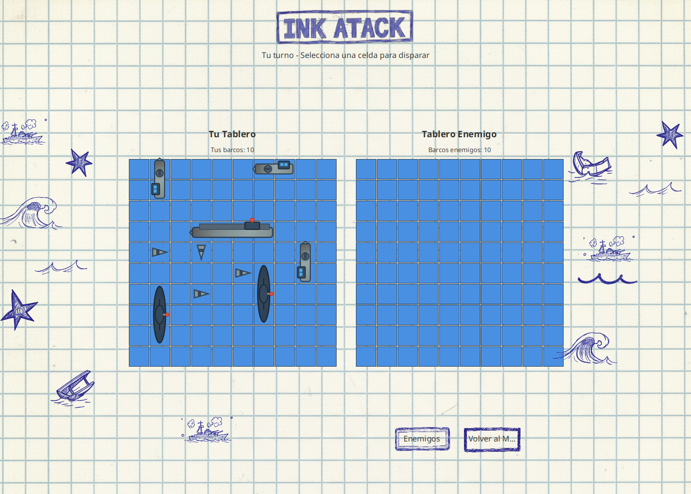
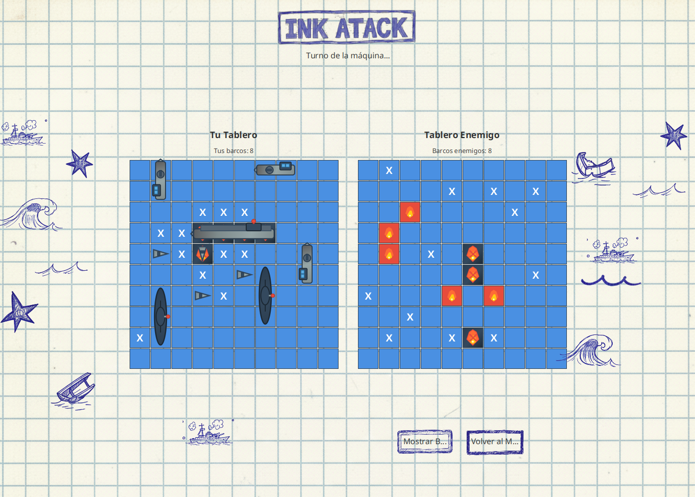
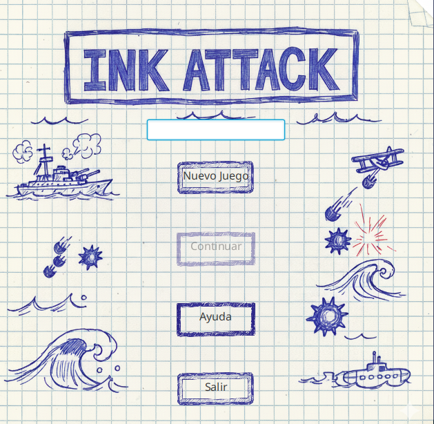
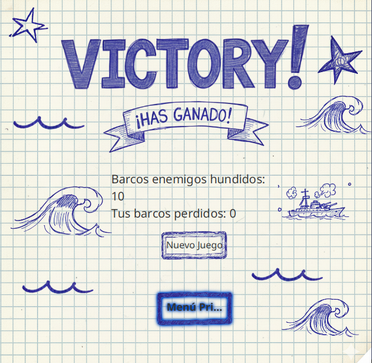
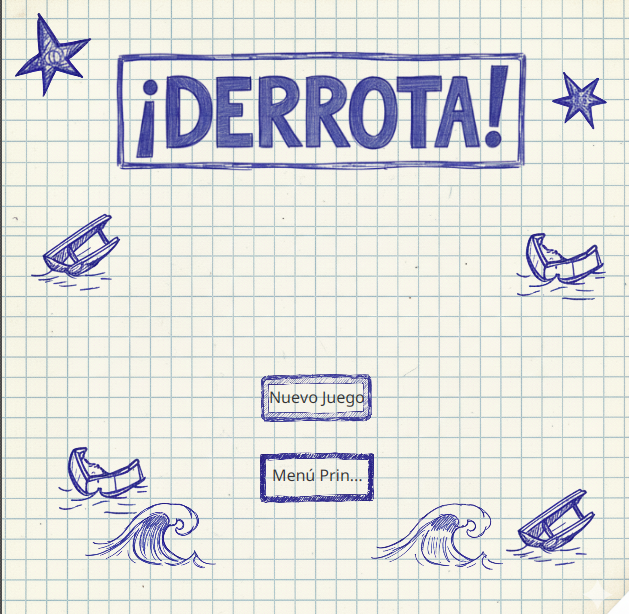
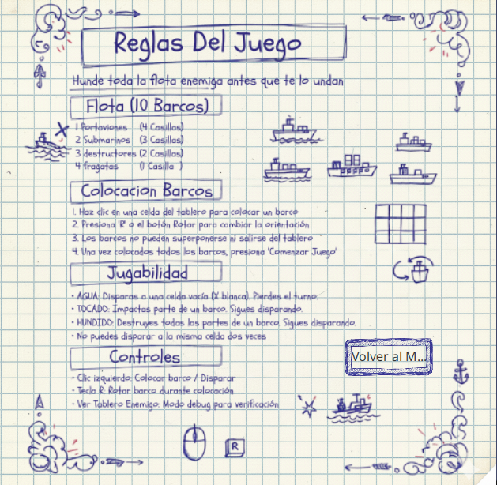

# 🚢 Battleship - Naval Battle Game

<div align="center">


[](https://www.java.com/)
[](https://openjfx.io/)
[](LICENSE)
[](BUILD)

**⚓ Navigate the seas, command your fleet, and sink enemy ships! ⚓**

[Features](#-features) • [Installation](#-installation) • [How to Play](#-how-to-play) • [Architecture](#-architecture) • [Testing](#-testing)

</div>

---

## 🎮 Game Preview

<div align="center">

### Main Game Interface

*Strategic gameplay with dual board view*

### Ship Placement Phase

*Intuitive ship placement with visual preview*

### Battle in Action

*Real-time combat with hit/miss indicators*

</div>

---

## 🌊 About The Project

**Battleship** is a classic naval warfare strategy game implemented in Java with JavaFX. Command your fleet, strategically place your ships, and engage in tactical combat against an intelligent AI opponent. 

This project showcases advanced software engineering principles including:
- 🎯 **Clean Architecture** with separation of concerns
- 🧩 **Design Patterns** (Singleton, Factory, Strategy)
- 💾 **Game State Persistence** with serialization
- 🤖 **Smart AI** with hunt-and-target algorithms
- ✅ **Comprehensive Testing** with JUnit 5

---

## ✨ Features

### 🎮 Core Gameplay
- **10x10 Grid Battle System** - Classic naval combat arena
- **Fleet Management** - Command 10 ships across 4 different types
- **Turn-Based Combat** - Strategic gameplay with intelligent AI
- **Real-time Visual Feedback** - Dynamic board updates and animations

### 🤖 Intelligent AI
- **Hunt Mode** - Efficient checkerboard pattern searching
- **Target Mode** - Smart adjacent cell targeting after hits
- **Adaptive Strategy** - AI learns and adjusts tactics during gameplay

### 💾 Game Features
- **Save/Load System** - Pause and resume your campaigns
- **Player Statistics** - Track your victories and sunk ships
- **Ship Placement Assistant** - Visual preview system with validation
- **Intuitive Controls** - Keyboard shortcuts (R to rotate) and mouse controls

### 🎨 Visual Design
- **Modern UI** - Clean JavaFX interface with custom styling
- **Color-Coded States** - Easy-to-read cell status indicators
  - 🔵 Water - Unexplored territory
  - ⚫ Ship - Your fleet positions
  - 🔴 Hit - Successful strikes
  - ⚪ Miss - Shots that missed
  - ⚫ Sunk - Destroyed vessels

<div align="center">

### UI Components Preview
<table>
  <tr>
    <td align="center">
      
      <br />
      <b>Main Menu</b>
    </td>
    <td align="center">
      
      <br />
      <b>Victory Screen</b>
    </td>
  </tr>
  <tr>
    <td align="center">
      
      <br />
      <b>Defeat Screen</b>
    </td>
    <td align="center">
      
      <br />
      <b>Help Menu</b>
    </td>
  </tr>
</table>

</div>

---

## 🚀 Installation

### Prerequisites

```bash
☕ Java 17 or higher
🎨 JavaFX 21.0.1
🛠️ Maven or Gradle (optional)
```

### Quick Start

1. **Clone the repository**
```bash
git clone https://github.com/yourusername/battleship-game.git
cd battleship-game
```

2. **Build the project**
```bash
# Using Maven
mvn clean install

# Or using Gradle
gradle build
```

3. **Run the game**
```bash
# Using Maven
mvn javafx:run

# Or directly with Java
java --module-path /path/to/javafx-sdk/lib --add-modules javafx.controls,javafx.fxml -jar battleship.jar
```

---

## 🎮 How to Play

### 🚢 Fleet Composition

Your naval fleet consists of 10 ships across 4 types:

| Ship Type | Size | Quantity | Icon |
|-----------|------|----------|------|
| 🛳️ **Carrier** (Portaaviones) | 4 cells | 1 | ████ |
| 🚤 **Submarine** (Submarino) | 3 cells | 2 | ███ |
| ⛵ **Destroyer** (Destructor) | 2 cells | 3 | ██ |
| 🛶 **Frigate** (Fragata) | 1 cell | 4 | █ |

### 📋 Game Rules

1. **Setup Phase**
   - Place all 10 ships on your board
   - Ships can be placed horizontally or vertically
   - Press `R` to rotate ships during placement
   - Ships cannot overlap or extend beyond the grid

2. **Battle Phase**
   - Players alternate turns shooting at opponent's grid
   - Click on enemy board cells to fire
   - Receive immediate feedback: Hit, Miss, or Sunk
   - First player to sink all enemy ships wins!

3. **Victory Conditions**
   - 🏆 Destroy all 10 enemy ships to win
   - ⚓ Lose when all your ships are sunk

### ⌨️ Controls

| Key/Action | Function |
|------------|----------|
| `R` | Rotate ship during placement |
| `Left Click` | Place ship / Fire shot |
| `Mouse Hover` | Preview ship placement |

---

## 🏗️ Architecture

### 📁 Project Structure

```
battleship/
├── 📦 model/
│   ├── 🤖 AI/              # AI strategy implementations
│   ├── 📋 Board/           # Game board management
│   ├── 🔲 Cell/            # Cell and coordinate system
│   ├── 🎮 Game/            # Game flow and state management
│   ├── 💾 GameSave/        # Persistence layer
│   ├── 🚢 Ship/            # Ship models and factories
│   ├── 🎯 Shot/            # Shot results and tracking
│   ├── 👤 Player/          # Player implementations
│   ├── ✅ Validation/      # Input validation
│   └── 🛠️ Utils/           # Utility classes
├── 🎨 view/
│   ├── 🖼️ Components/      # Custom UI components
│   └── 🎭 utils/           # View utilities (colors, shapes)
├── 🎛️ controller/          # JavaFX controllers
└── 🧪 test/                # Unit tests
```

### 🎯 Design Patterns

<div align="center">


*System architecture overview*

</div>

#### **Singleton Pattern**
```java
GameManager.getInstance() // Single game instance management
```

#### **Factory Pattern**
```java
ShipFactory.createFleet()  // Standardized ship creation
BoardFactory.createBoard() // Board instantiation
```

#### **Strategy Pattern**
```java
IAIStrategy              // Pluggable AI algorithms
RandomAIStrategy         // Hunt-and-target implementation
```

#### **MVC Architecture**
- **Model**: Business logic, game rules, and data management
- **View**: JavaFX UI components and visualization
- **Controller**: User input handling and view updates

---

## 🧪 Testing

### Running Tests

```bash
# Run all tests
mvn test

# Run specific test class
mvn test -Dtest=BoardTest

# Generate coverage report
mvn jacoco:report
```

### Test Coverage

- ✅ **Board Operations** - 100% coverage
- ✅ **Ship Management** - 100% coverage
- ✅ **Validation Logic** - 100% coverage
- ✅ **Game Flow** - Comprehensive integration tests

### Key Test Classes

```java
📝 BoardTest                    // Board functionality tests
📝 BoardValidatorTest           // Validation logic tests
📝 ShipPlacementValidatorTest   // Placement rule tests
```

---

## 🔧 Technologies

<div align="center">

| Technology | Purpose |
|------------|---------|
|  | Core programming language |
|  | UI framework |
|  | Testing framework |
|  | Build automation |

</div>

---

## 📊 Game Statistics

Track your performance:
- 🎯 Shots fired
- 💥 Successful hits
- 🚢 Ships sunk
- 🏆 Games won
- 📈 Win percentage

---

## 🤝 Contributing

Contributions are welcome! Feel free to:

1. 🍴 Fork the repository
2. 🔨 Create your feature branch (`git checkout -b feature/AmazingFeature`)
3. 💾 Commit your changes (`git commit -m 'Add some AmazingFeature'`)
4. 📤 Push to the branch (`git push origin feature/AmazingFeature`)
5. 🔃 Open a Pull Request

---

## 📝 License

This project is licensed under the MIT License - see the [LICENSE](LICENSE) file for details.

---

## 👨‍💻 Authors

**Juan Atuesta**
- GitHub: [@Atuesta117](https://github.com/Atuesta117)
- Email: atuesta.juan@correounivalle.edu.co

**Juan Camilo Ramos**
- GitHub: [@juancamilor1707](https://github.com/juancamilor1707)
- Email: juancamiloramos01@gmail.com

**Juan Manuel**
- GitHub: [@yourusername](https://github.com/juancamilor1707)
- Email: juan.munoz.delgado@gmail.com


---

## 🙏 Acknowledgments

- Classic Battleship game for inspiration
- JavaFX community for excellent documentation
- Contributors and testers

---

<div align="center">

### ⚓ Set Sail and Dominate the Seas! ⚓

**Made with ❤️ and ☕ by passionate developers**

[](https://github.com/yourusername/battleship/stargazers)
[](https://github.com/yourusername/battleship/network/members)

---

### 📸 More Screenshots

<details>
<summary>Click to expand gallery</summary>

<br/>

#### Game Progression

*Early game strategy*


*Tactical mid-game decisions*


*Final showdown*

#### UI Details

*Cell state indicators*


*Ship rotation mechanic*

</details>

</div>
